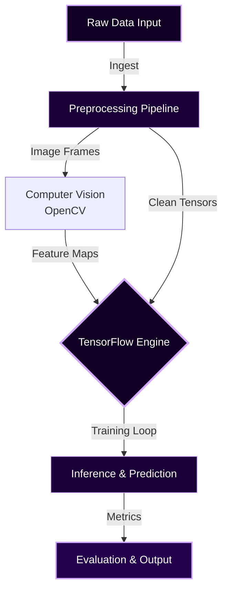

<div align="center">

![Header](data:image/svg+xml;base64,PHN2ZyB3aWR0aD0iODAwIiBoZWlnaHQ9IjIwMCIgdmlld0JveD0iMCAwIDgwMCAyMDAiIHhtbG5zPSJodHRwOi8vd3d3LnczLm9yZy8yMDAwL3N2ZyI+CiAgPGRlZnM+CiAgICA8bGluZWFyR3JhZGllbnQgaWQ9ImJnIiB4MT0iMCUiIHkxPSIwJSIgeDI9IjEwMCUiIHkyPSIxMDAlIj4KICAgICAgPHN0b3Agb2Zmc2V0PSIwJSIgc3RvcC1jb2xvcj0iIzEyMDAyNCIvPgogICAgICA8c3RvcCBvZmZzZXQ9IjUwJSIgc3RvcC1jb2xvcj0iIzFhMDAzNiIvPgogICAgICA8c3RvcCBvZmZzZXQ9IjEwMCUiIHN0b3AtY29sb3I9IiMyNDAwNGQiLz4KICAgIDwvbGluZWFyR3JhZGllbnQ+CiAgICA8ZmlsdGVyIGlkPSJnbG93Ij4KICAgICAgPGZlR2F1c3NpYW5CbHVyIHN0ZERldmlhdGlvbj0iNCIgcmVzdWx0PSJiIi8+CiAgICAgIDxmZUNvbXBvc2l0ZSBpbj0iU291cmNlR3JhcGhpYyIgaW4yPSJiIiBvcGVyYXRvcj0ib3ZlciIvPgogICAgPC9maWx0ZXI+CiAgICA8ZmlsdGVyIGlkPSJnbG93MiI+CiAgICAgIDxmZUdhdXNzaWFuQmx1ciBzdGREZXZpYXRpb249IjgiIHJlc3VsdD0iYiIvPgogICAgICA8ZmVDb21wb3NpdGUgaW49IlNvdXJjZUdyYXBoaWMiIGluMj0iYiIgb3BlcmF0b3I9Im92ZXIiLz4KICAgIDwvZmlsdGVyPgogIDwvZGVmcz4KICA8cmVjdCB3aWR0aD0iMTAwJSIgaGVpZ2h0PSIxMDAlIiBmaWxsPSJ1cmwoI2JnKSIgcng9IjEyIi8+CiAgCiAgPCEtLSBHcmlkIGxpbmVzIC0tPgogIDxsaW5lIHgxPSIwIiB5MT0iNTAiIHgyPSI4MDAiIHkyPSI1MCIgc3Ryb2tlPSIjZDJhOGZmIiBvcGFjaXR5PSIwLjA1IiBzdHJva2Utd2lkdGg9IjEiLz4KICA8bGluZSB4MT0iMCIgeTE9IjEwMCIgeDI9IjgwMCIgeTI9IjEwMCIgc3Ryb2tlPSIjZDJhOGZmIiBvcGFjaXR5PSIwLjA1IiBzdHJva2Utd2lkdGg9IjEiLz4KICA8bGluZSB4MT0iMCIgeTE9IjE1MCIgeDI9IjgwMCIgeTI9IjE1MCIgc3Ryb2tlPSIjZDJhOGZmIiBvcGFjaXR5PSIwLjA1IiBzdHJva2Utd2lkdGg9IjEiLz4KICA8bGluZSB4MT0iMjAwIiB5MT0iMCIgeDI9IjIwMCIgeTI9IjIwMCIgc3Ryb2tlPSIjZDJhOGZmIiBvcGFjaXR5PSIwLjA1IiBzdHJva2Utd2lkdGg9IjEiLz4KICA8bGluZSB4MT0iNDAwIiB5MT0iMCIgeDI9IjQwMCIgeTI9IjIwMCIgc3Ryb2tlPSIjZDJhOGZmIiBvcGFjaXR5PSIwLjA1IiBzdHJva2Utd2lkdGg9IjEiLz4KICA8bGluZSB4MT0iNjAwIiB5MT0iMCIgeDI9IjYwMCIgeTI9IjIwMCIgc3Ryb2tlPSIjZDJhOGZmIiBvcGFjaXR5PSIwLjA1IiBzdHJva2Utd2lkdGg9IjEiLz4KICAKICAKICA8Y2lyY2xlIGN4PSI0NjAiIGN5PSIzMCIgcj0iMiIgZmlsbD0iI2QyYThmZiIgb3BhY2l0eT0iMC42Ij4KICAgIDxhbmltYXRlIGF0dHJpYnV0ZU5hbWU9ImN4IiB2YWx1ZXM9IjQ2MDsgMzQwOyA0NjAiIGR1cj0iNXMiIHJlcGVhdENvdW50PSJpbmRlZmluaXRlIiAvPgogICAgPGFuaW1hdGUgYXR0cmlidXRlTmFtZT0ib3BhY2l0eSIgdmFsdWVzPSIwLjM7IDAuOTsgMC4zIiBkdXI9IjZzIiByZXBlYXRDb3VudD0iaW5kZWZpbml0ZSIgLz4KICA8L2NpcmNsZT4KICA8Y2lyY2xlIGN4PSIxNDAiIGN5PSI1NSIgcj0iMyIgZmlsbD0iI2QyYThmZiIgb3BhY2l0eT0iMC42Ij4KICAgIDxhbmltYXRlIGF0dHJpYnV0ZU5hbWU9ImN4IiB2YWx1ZXM9IjE0MDsgNjYwOyAxNDAiIGR1cj0iNnMiIHJlcGVhdENvdW50PSJpbmRlZmluaXRlIiAvPgogICAgPGFuaW1hdGUgYXR0cmlidXRlTmFtZT0ib3BhY2l0eSIgdmFsdWVzPSIwLjM7IDAuOTsgMC4zIiBkdXI9IjdzIiByZXBlYXRDb3VudD0iaW5kZWZpbml0ZSIgLz4KICA8L2NpcmNsZT4KICA8Y2lyY2xlIGN4PSI0NjAiIGN5PSI4MCIgcj0iNCIgZmlsbD0iI2QyYThmZiIgb3BhY2l0eT0iMC42Ij4KICAgIDxhbmltYXRlIGF0dHJpYnV0ZU5hbWU9ImN4IiB2YWx1ZXM9IjQ2MDsgMzQwOyA0NjAiIGR1cj0iNXMiIHJlcGVhdENvdW50PSJpbmRlZmluaXRlIiAvPgogICAgPGFuaW1hdGUgYXR0cmlidXRlTmFtZT0ib3BhY2l0eSIgdmFsdWVzPSIwLjM7IDAuOTsgMC4zIiBkdXI9IjZzIiByZXBlYXRDb3VudD0iaW5kZWZpbml0ZSIgLz4KICA8L2NpcmNsZT4KICA8Y2lyY2xlIGN4PSI1ODAiIGN5PSIxMDUiIHI9IjIiIGZpbGw9IiNkMmE4ZmYiIG9wYWNpdHk9IjAuNiI+CiAgICA8YW5pbWF0ZSBhdHRyaWJ1dGVOYW1lPSJjeCIgdmFsdWVzPSI1ODA7IDIyMDsgNTgwIiBkdXI9IjRzIiByZXBlYXRDb3VudD0iaW5kZWZpbml0ZSIgLz4KICAgIDxhbmltYXRlIGF0dHJpYnV0ZU5hbWU9Im9wYWNpdHkiIHZhbHVlcz0iMC4zOyAwLjk7IDAuMyIgZHVyPSI1cyIgcmVwZWF0Q291bnQ9ImluZGVmaW5pdGUiIC8+CiAgPC9jaXJjbGU+CiAgPGNpcmNsZSBjeD0iNDIwIiBjeT0iMTMwIiByPSIzIiBmaWxsPSIjZDJhOGZmIiBvcGFjaXR5PSIwLjYiPgogICAgPGFuaW1hdGUgYXR0cmlidXRlTmFtZT0iY3giIHZhbHVlcz0iNDIwOyAzODA7IDQyMCIgZHVyPSI1cyIgcmVwZWF0Q291bnQ9ImluZGVmaW5pdGUiIC8+CiAgICA8YW5pbWF0ZSBhdHRyaWJ1dGVOYW1lPSJvcGFjaXR5IiB2YWx1ZXM9IjAuMzsgMC45OyAwLjMiIGR1cj0iNnMiIHJlcGVhdENvdW50PSJpbmRlZmluaXRlIiAvPgogIDwvY2lyY2xlPgogIDxjaXJjbGUgY3g9IjMwMCIgY3k9IjE1NSIgcj0iNCIgZmlsbD0iI2QyYThmZiIgb3BhY2l0eT0iMC42Ij4KICAgIDxhbmltYXRlIGF0dHJpYnV0ZU5hbWU9ImN4IiB2YWx1ZXM9IjMwMDsgNTAwOyAzMDAiIGR1cj0iNnMiIHJlcGVhdENvdW50PSJpbmRlZmluaXRlIiAvPgogICAgPGFuaW1hdGUgYXR0cmlidXRlTmFtZT0ib3BhY2l0eSIgdmFsdWVzPSIwLjM7IDAuOTsgMC4zIiBkdXI9IjdzIiByZXBlYXRDb3VudD0iaW5kZWZpbml0ZSIgLz4KICA8L2NpcmNsZT4KICAKICA8IS0tIFNjYW5uaW5nIGxpbmUgLS0+CiAgPHJlY3QgeD0iMCIgeT0iMCIgd2lkdGg9IjgwMCIgaGVpZ2h0PSIzIiBmaWxsPSIjZDJhOGZmIiBvcGFjaXR5PSIwLjMiPgogICAgPGFuaW1hdGUgYXR0cmlidXRlTmFtZT0ieSIgdmFsdWVzPSIwOyAyMDA7IDAiIGR1cj0iNnMiIHJlcGVhdENvdW50PSJpbmRlZmluaXRlIi8+CiAgPC9yZWN0PgogIAogIDx0ZXh0IHg9IjUwJSIgeT0iNDIlIiBmb250LWZhbWlseT0iQXJpYWwsc2Fucy1zZXJpZiIgZm9udC13ZWlnaHQ9ImJvbGQiIGZvbnQtc2l6ZT0iMzgiIGZpbGw9IiNkMmE4ZmYiIHRleHQtYW5jaG9yPSJtaWRkbGUiIGZpbHRlcj0idXJsKCNnbG93KSIgc3R5bGU9ImxldHRlci1zcGFjaW5nOjRweCI+CiAgICBHRVNUVVJFIENPTlRST0wgU1lTVEVNCiAgPC90ZXh0PgogIDx0ZXh0IHg9IjUwJSIgeT0iNjIlIiBmb250LWZhbWlseT0iQXJpYWwsc2Fucy1zZXJpZiIgZm9udC1zaXplPSIxMyIgZmlsbD0iI2IzODhmZiIgdGV4dC1hbmNob3I9Im1pZGRsZSIgc3R5bGU9ImxldHRlci1zcGFjaW5nOjNweDtvcGFjaXR5OjAuOCI+CiAgICBQUk9QUklFVEFSWSBQWVRIT04gQVJDSElURUNUVVJFCiAgPC90ZXh0PgogIAogIDwhLS0gQm90dG9tIGFjY2VudCBsaW5lIC0tPgogIDxsaW5lIHgxPSIyNTAiIHkxPSIxNzUiIHgyPSI1NTAiIHkyPSIxNzUiIHN0cm9rZT0iI2QyYThmZiIgc3Ryb2tlLXdpZHRoPSIyIiBmaWx0ZXI9InVybCgjZ2xvdykiPgogICAgPGFuaW1hdGUgYXR0cmlidXRlTmFtZT0ieDEiIHZhbHVlcz0iMjUwOzMwMDsyNTAiIGR1cj0iM3MiIHJlcGVhdENvdW50PSJpbmRlZmluaXRlIi8+CiAgICA8YW5pbWF0ZSBhdHRyaWJ1dGVOYW1lPSJ4MiIgdmFsdWVzPSI1NTA7NTAwOzU1MCIgZHVyPSIzcyIgcmVwZWF0Q291bnQ9ImluZGVmaW5pdGUiLz4KICA8L2xpbmU+Cjwvc3ZnPg==)

<br/>

<p align="center">
  
  
  
  
</p>

  
  

<br/>


</div>

---

## Overview

> Controls mouse and keyboard actions via hand gestures using webcam.

**Gesture Control System** is an advanced machine learning / ai system engineered by **Karthik Idikuda**. Built with OpenCV, TensorFlow.

<br/>

## System Architecture



<br/>

## Project Structure

```
Gesture-Control-System/
  .gitignore
  LICENSE
  README.md
  gui.py
  hand_tracking.py
  main.py
  requirements.txt
  system_control.py
```

<br/>

## Technical Specifications

| Attribute | Detail |
|:---|:---|
| **Primary Language** | `Python` |
| **Project Category** | `Machine Learning / AI` |
| **Total Source Files** | `8` |
| **Frameworks** | `OpenCV`, `TensorFlow` |
| **IP Status** | `Strictly Proprietary` |

## Dependencies

<p align="left">
  <code>numpy</code>  <code>screen-brightness-control</code>  <code>protobuf</code>  <code>pillow</code>  <code>customtkinter</code>  <code>pyautogui</code>  <code>opencv-python</code>  <code>tensorflow<2.15</code>  <code>mediapipe</code>
</p>


## STRICT LEGAL WARNING

> **PROPRIETARY AND CONFIDENTIAL**

This software is the **exclusive property of Karthik Idikuda**.

- **NO PERMISSION** to use, copy, modify, or distribute without written consent.
- **UNAUTHORIZED USE** results in litigation, financial penalties, and criminal prosecution.
- **LICENSING:** Contact Karthik Idikuda directly to negotiate terms.

*By viewing this repository, you accept these proprietary terms.*

---

<div align="center">
  <br/>
  
</div>

<!-- WATERMARK: S0ktUFJPUFJJRVRBUlktR2VzdHVyZS1Db250cm9sLVN5c3RlbS0yMDI2 -->
